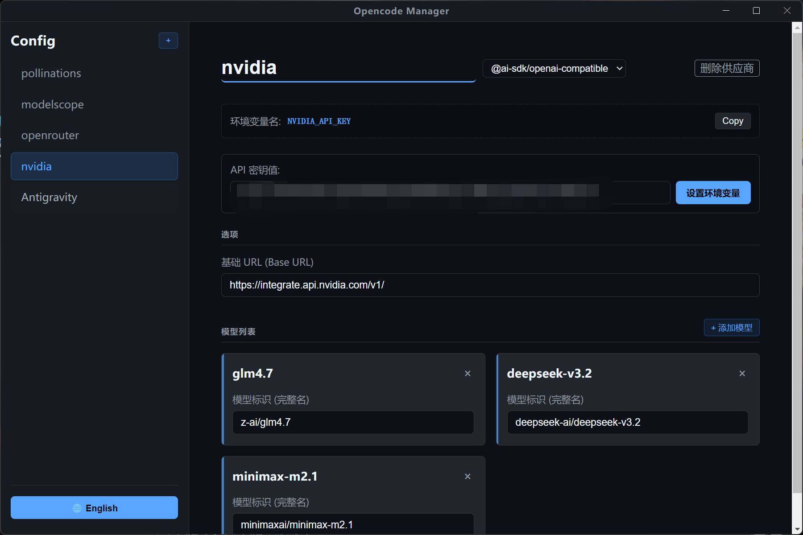

# Opencode Manager



Opencode Manager 是一个用于管理 Opencode 配置文件 (`opencode.json`) 的桌面应用程序。它允许您轻松查看、编辑、添加和删除 AI 模型提供商及其模型配置。


## 更新日志

### v1.0.1 (2025-01-16)

- ✨ **API 密钥管理增强**：
  - **自动配置环境变量**：不再在配置文件中明文存储 API Key，而是自动生成 `{env:PROVIDER_NAME_API_KEY}` 格式的引用。
  - **系统环境变量设置**：新增 UI 界面，直接输入 API Key 值并一键设置为系统环境变量（支持 Windows `setx` 及 macOS/Linux `PROFILE` 文件）。
  - **即时生效**：设置环境变量后无需重启应用即可被当前进程读取。
  - **自动回显**：自动检测并显示当前已存在的环境变量值。
  - **明文显示**：API Key 输入框改为明文显示，方便核对。
- 🔄 **供应商 ID 同步**：修改供应商名称时，底层 ID (Key) 会自动同步更新，确保配置一致性。
- 🛠 **协议选择**：新增 Protocol/SDK 选择下拉框（支持 `@ai-sdk/openai-compatible` 和 `@ai-sdk/anthropic`）。
- 🏗 **多平台构建**：完善了 Windows、macOS 和 Linux 的构建脚本配置。
- 🧹 **代码重构**：将翻译文件拆分至独立模块，优化代码结构。

## 功能特性

- 🛠 **可视化管理**：图形化界面管理 `opencode.json` 配置。
- ➕ **供应商管理**：添加、删除、重命名模型供应商。
- 🤖 **模型管理**：添加、删除模型，支持自动生成短名称。
- 💾 **自动保存**：所有更改会自动保存到配置文件，无需手动操作。
- 🌍 **多语言支持**：支持中文和英文切换。
- 🎨 **现代 UI**：精致的暗色模式界面，灵感来自 GitHub Dark。
- 📦 **跨平台**：基于 Electron 构建，支持 Windows (已测试)、macOS 和 Linux。

## 安装

### 方式一：使用安装包 (Windows)

1. 在 [Releases](../../releases) 页面下载最新的安装程序 `Opencode Manager Setup x.x.x.exe`。
2. 双击运行安装程序完成安装。

### 方式二：使用便携版 (Windows)

1. 下载便携版压缩包或直接下载 `release/win-unpacked` 文件夹。
2. 运行 `Opencode Manager.exe` 即可使用。

## 开发构建

如果您是开发者，想要自行构建或修改本项目：

### 前置要求

- Node.js (建议 v16+)
- npm 或 yarn

### 步骤

1. 克隆仓库或下载源码：
   ```bash
   git clone <repository-url>
   cd opencode-manager
   ```

2. 安装依赖：
   ```bash
   npm install
   ```

3. 启动开发模式：
   ```bash
   npm run dev
   ```

4. 构建生产版本：
   ```bash
   npm run build
   ```
   构建完成后，exe 文件将生成在 `release/` 目录下。

## 配置文件位置

程序会自动读取和保存以下位置的配置文件：
- Windows: `%USERPROFILE%/.config/opencode/opencode.json`
- macOS/Linux: `~/.config/opencode/opencode.json`

如果文件不存在，程序会自动创建一个默认的配置文件。

## 技术栈

- **Electron**: 桌面应用框架
- **React**:以此构建用户界面
- **Vite**: 快速构建工具
- **Electron Builder**: 打包工具

## 许可证

ISC
